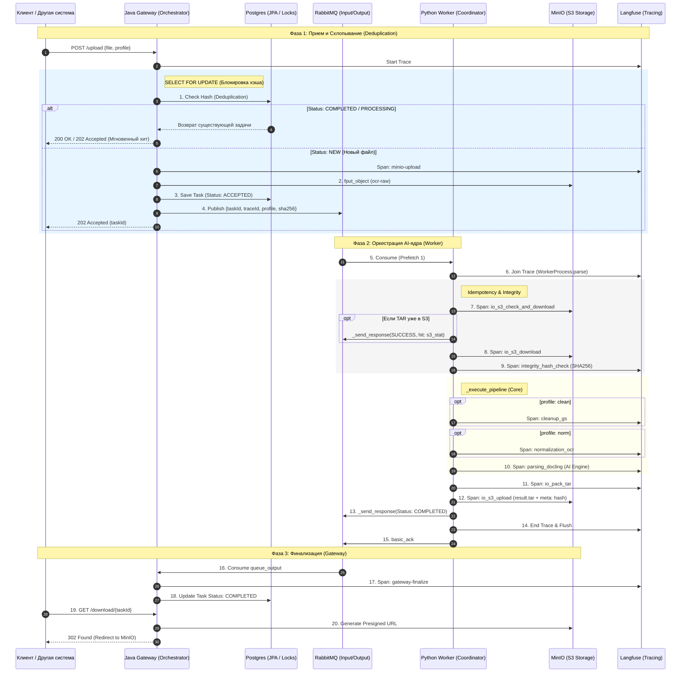

# OCR-Gateway: Шлюз распределенной оцифровки документов

Архитектурное решение для массового распознавания и структурирования документов. Система спроектирована как высоконадежный конвейер для подготовки данных для AI-аналитики и обучения нейросетей.

## 🚀 Цель проекта
Создание масштабируемой системы (Java + Python + RabbitMQ), которая берет на себя всю рутину по приему, очистке и глубокому парсингу тяжелых PDF, обеспечивая экономию ресурсов за счет умной дедупликации.

## 🧬 Ключевые возможности
*   **Умная дедупликация (SHA-256):** Система узнает файлы, которые уже обрабатывались. Повторный запрос выдает результат мгновенно (0 мс), не нагружая нейросети.
*   **Асинхронный конвейер:** Java-шлюз моментально принимает файл и отдает ID задачи. Тяжелая обработка (OCR, анализ структуры) идет в фоне на кластере Python-воркеров.
*   **Сквозной контроль (Tracing):** Благодаря интеграции с **Langfuse**, виден весь путь документа — от REST-контроллера до каждой секунды работы нейросети внутри Docker-контейнера.
*   **Прямая выдача (302 Redirect):** Шлюз не проксирует байты через себя. Клиент получает временную Presigned-ссылку и скачивает результат напрямую из S3-хранилища (MinIO).

## 🛠 Стек технологий
*   **Orchestrator (Ядро):** Java 21, Spring Boot 4
*   **Worker (Исполнитель):** Python 3.11 (Docling, OCRmyPDF, Ghostscript)
*   **База данных:** PostgreSQL (состояния задач и метаданные)
*   **Хранилище:** MinIO (S3-совместимое)
*   **Шина данных:** RabbitMQ (асинхронные очереди)
*   **Observability:** Langfuse (Distributed Tracing)

## 📊 Текущий статус проекта
- [x] Проектирование БД и сущностей (`FileEntity`, `TaskEntity`)
- [x] Логика дедупликации (Pioneer/Follower паттерн)
- [x] Интеграция с объектным хранилищем MinIO
- [x] **Внедрение Langfuse** (распределенный трейсинг Java ↔ Python)
- [x] **Очереди RabbitMQ** (асинхронный обмен задачами и статусами)
- [x] **Python Worker:** Оркестрация пайплайна (Cleanup -> OCR -> Docling). CPU/GPU ready
- [x] **Hybrid Storage:** Метаданные в БД, тяжелые архивы (JSON/MD/Images) в S3
- [ ] Внедрение кэширования (Redis) — *в бэклоге*
- [ ] Автоматизация бакетов MinIO (Terraform/Java-init) — *в бэклоге*

## 📊 Статус разработки
- [x] Проектирование БД сущностей (`FileEntity`, `TaskEntity`)
- [x] Выбор стратегии дедупликации
- [x] Реализация FileService и интеграция с MinIO
- [x] Внедрение LangFuse
- [x] Описание RabbitMQ контракта
- [x] **[ocr-worker/README.md](ocr-worker/README.md):** API часть реализована (см. документацию), интеграция с RabbitMQ в работе.
- [ ] Внедрение кэширования (Redis)
- [ ] Валидация входных структур  (Hibernate Validator)
- [ ] Настройка мониторинга и алертинга (Spring Boot Actuator)
- [ ] CI/CD + SWARM

