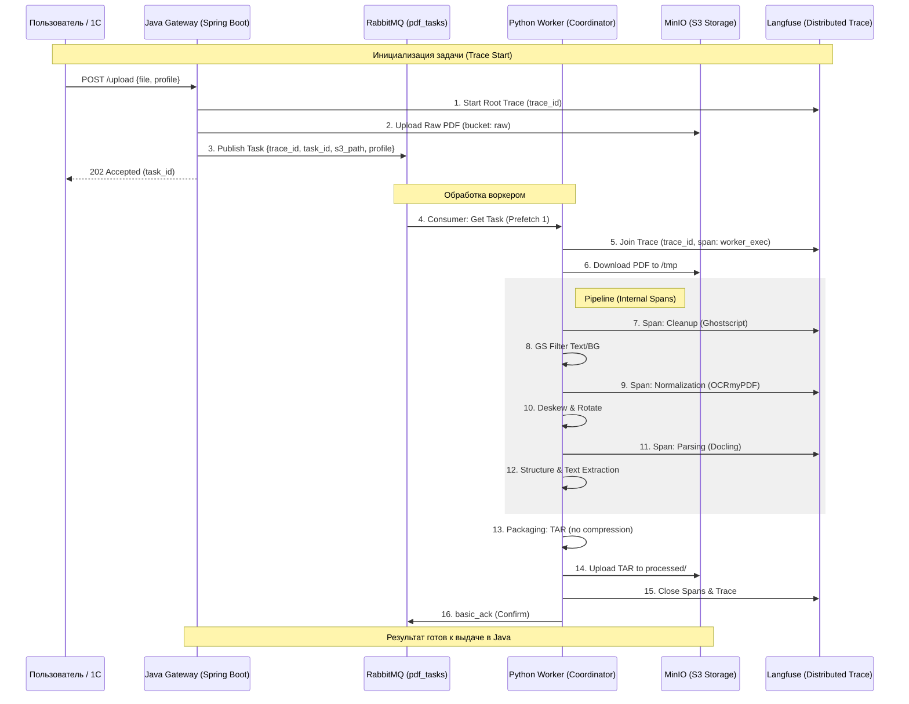

# OCR-Gateway Highload

Архитектурный шлюз для оцифровки документов с упором на сбор данных для AI-аналитики.

## 🚀 Цель проекта
Создание масштабируемого конвейера (Java + Python + RabbitMQ) для распознавания документов с фиксацией метрик (Lineage) для последующего обучения Арбитра моделей.

## 🛠 Стек
- **Backend:** Java 21, Spring Boot 4, Hibernate  (JSONB support)
- **DB:** PostgreSQL (pgvector ready)
- **Storage:** MinIO (S3-compatible)
- **Broker:** RabbitMQ
- **Observability:** LangFuse

## 🧬 Архитектурные особенности
- **Content Addressable Storage:** Дедупликация файлов на основе SHA-256.
- **Async Pipeline:** Разделение процессов загрузки и обработки.
- **Model Lineage:** Сохранение версий моделей и таймингов каждого этапа в `steps_log`.
- **Hybrid Storage:** Метаданные в БД, тяжелые MD/JSON результаты в MinIO.

## 📊 Статус разработки
- [x] Проектирование БД сущностей (`FileEntity`, `TaskEntity`)
- [x] Выбор стратегии дедупликации
- [x] Реализация FileService и интеграция с MinIO
- [ ] Внедрение LangFuse
- [ ] Описание RabbitMQ контракта
- [ ] **[ocr-worker/README.md](ocr-worker/README.md):** API часть реализована (см. документацию), интеграция с RabbitMQ в работе.
- [ ] Внедрение кэширования (Redis)
- [ ] Валидация входных структур  (Hibernate Validator)
- [ ] Настройка мониторинга и алертинга (Spring Boot Actuator)
- [ ] CI/CD + SWARM

