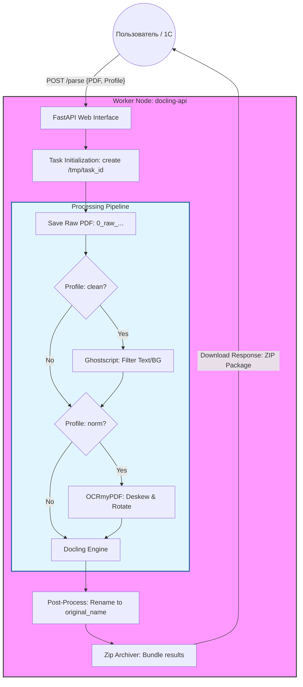

# 📄 Docling & OCR Worker Service

Микросервис для глубокого анализа и очистки PDF-документов. Поддерживает профили обработки (clean/norm), OCR и экспорт в структурированные форматы.

## 🏗 Архитектура процесса



🛠 Функционал

    Ghostscript: Очистка фона и фильтрация текстовых слоев.
    OCRmyPDF: Выравнивание (deskew), поворот страниц и распознавание текста.
    Docling Engine: Парсинг структуры документа в Markdown/JSON.
    EasyOCR: Поддержка распознавания русского и английского языков.

🚀 Инструкция по развертыванию
1. Сборка (без BuildKit)
Запустите сборку из корневой директории Python-проекта:

```bash
sudo docker build -t docling-api .
```

Используйте код с осторожностью.
Образ весит ~7-8 ГБ из-за ML-моделей и CUDA-слоев.
2. Запуск

```bash
# Для CPU
docker run -d -p 8000:8000 --name ocr-worker docling-api

# Для GPU (требуется nvidia-container-toolkit)
docker run -d -p 8000:8000 --gpus all --name ocr-worker docling-api
```

3. Использование
После запуска перейдите на http://localhost:8000/docs для доступа к интерактивной документации Swagger.   
📁 Структура проекта:
- web_api.py — FastAPI интерфейс для быстрой проверки гипотез.
- docling_parser.py — Ядро обработки и интеграция с Docling. 
- preprocessor.py — клас предварительной обработки
- processing_profile.py — классификатор профилей обработки
- coordinator.py — класс работы с задачами основного шлюза.
- Dockerfile — Конфигурация окружения (Ubuntu 22.04 + CUDA 12.1).
- requirements.txt — Список зависимостей (PyTorch, Docling, EasyOCR, Pika).


📦 Пре-загрузка моделей: Основные веса Docling и EasyOCR интегрированы в образ на этапе сборки для минимизации задержек при первом запуске и сокращения внешнего трафика.

## Лицензия
Проект распространяется под лицензией MIT [License](./LICENSE) (на английском языке).